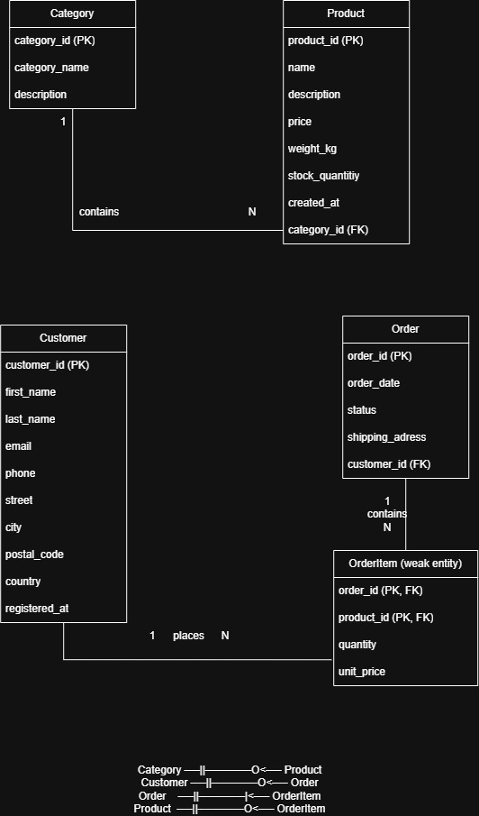

# Week 38 — Conceptual Data Modelling: Exercises

> [!IMPORTANT]
> ***How to Complete These Exercises***
> Write your answers directly in the highlighted **Your Answer** / **Your SQL** fields below each task. Replace the placeholder text with your own work before submitting.

These exercises accompany the Week 38 Theory material. Refer to the theory sections indicated in brackets when you need help.

---

## Exercise 1: TrailShop Project Task — Create the ER Diagram

**Goal:** Create a complete Entity-Relationship diagram for the TrailShop database using crow's foot notation.

### Instructions

Using the entity descriptions from Theory Section 12, create an ER diagram that includes:

1. **All five entities**: Category, Product, Customer, Order, OrderItem
2. **All attributes** for each entity (as listed in Section 12.1)
3. **Primary keys** clearly marked (underline or "PK" label)
4. **Foreign keys** clearly marked (dashed underline or "FK" label)
5. **Relationships** between entities with:
   - Relationship name (verb)
   - Crow's foot notation showing cardinality and participation
6. **Identify weak entities** — mark OrderItem as a weak entity

### Requirements

- Use crow's foot notation (see Theory Section 9)
- You may use any tool: draw.io, Lucidchart, ERDPlus, dbdiagram.io, or even pen and paper (photograph and submit)
- The diagram must be readable — avoid crossing lines where possible
- Include a brief legend explaining your notation if using pen and paper

### Deliverables

- The ER diagram (image or link to online tool)
- A short written paragraph (3–5 sentences) explaining one design decision you made — for example, why OrderItem is a weak entity, or why `unit_price` is stored in OrderItem instead of being looked up from Product.

> [!NOTE]
> ***Your Answer***
>
> 
>
> I chose to make OrderItem a weak entity, because it depends on Order. If the Order is deleted, then the OrderItem is also deleted. Unit_price is stored in OrderItem, because the price of a product can change over time, so we need to store the price at the time of purchase.

---

## Exercise 2: Theory Review Questions

Answer each question in 2–4 sentences. Reference the relevant theory section.

1. Why should you create a conceptual data model before writing SQL? Give two specific reasons. *(Section 1)*

> [!NOTE]
> ***Your Answer***
>
> Its mandatory for the preperation of the database, because restructuring a database in production with all the data in it is painful, risky and expensive. The conceptual data model lets you think of what data exists, how it relates and what rules govern it.
>
>
>
>

2. What is the difference between the conceptual level and the logical level of a data model? *(Section 2)*

> [!NOTE]
> ***Your Answer***
>
> Conceptual level: This is the unified, organization-wide view of all the data and the relationships between data elements. Basically its the ER Diagram.
>
> Logical Level: This translates the conceptual model into the structures of a specific type of database system (relational, document, graph, etc.). Basically its the relational schema
>
>

3. Explain logical data independence with an example. *(Section 3)*

> [!NOTE]
> ***Your Answer***
>
> With logical data independence, the data and its structures can be changed without affecting the conceptual or external schema. So if we change something, the view of the user doesnt change. For example: You split the products table into products and product_details. The warehouse team's view still works because you redefine it to JOIN the two tables. 
>
>
>
>

4. Explain physical data independence with an example. *(Section 3)*

> [!NOTE]
> ***Your Answer***
>
> With physical independence you can change the internal schema without affecting the conceptual orexternal schema. For example: You move the database from one disk to another, You add an index on products.name to speed up searches, You switch from B-tree to hash indexing and none of the SQL queries or views change. 
>
>
>
>

5. What is the difference between a strong entity and a weak entity? Give one example of each (not from TrailShop). *(Section 5)*

> [!NOTE]
> ***Your Answer***
>
> Strong Entity: An entity that has its own unique identifier (primary key) and can exist independently of other entities. Example: A Customer.

Weak Entity: An entity that cannot exist independently and relies on a strong entity for its identification. It does not have its own unique identifier but rather a partial identifier that is combined with the primary key of the strong entity to form a unique identifier. Example: An OrderItem, because it depends on the Order.
>
>
>
>

6. What is a composite attribute? How does it differ from a multivalued attribute? Give an example of each. *(Section 6)*

> [!NOTE]
> ***Your Answer***
>
> A composite attribute can be divided into smaller, meaningful sub-attributes. For Exmaple: A Person can be divided into Name, Address, City, State. A multivalued attribute can hold multiple values for a single entity instance. For Example: phone numbers, product tags
>
>
> 
>

7. What is a derived attribute? Why is it usually not stored in the database? *(Section 6)*

> [!NOTE]
> ***Your Answer***
>
> A derived attribute is one whose value can be calculated from other attributes. It is not stored directly but computed when needed. Its not stored because it can become inconsistent with the source data.
>
>
>
>

8. Explain the difference between a binary relationship and a unary (recursive) relationship. Give an example of each. *(Section 7)*
> [!NOTE]
> ***Your Answer***
>
> A binary relationship involves exactly two entity types. This is the most common type. For Example: Product belongs to category. A unary relationship (also called recursive) involves a single entity type related to itself. For example: Category is_subcategory_of Category "Hiking Boots" is a subcategory of "Footwear." Both are categories.
>


9. What is the difference between an identifying relationship and a non-identifying relationship? How does this affect the child table's primary key? *(Section 7)*
> [!NOTE]
> ***Your Answer***
>
> In a non-identifying relationship the two entities are independent and can exist alone. In an identifying relationship the one entity (the weak one) cant exist alone and is depent from the primary key. It affects the child table's primary key by the foreign key of the parent table being part of the primary key of the child table.
>


10. In crow's foot notation, what does the following endpoint mean: a circle followed by a crow's foot (fork)? *(Section 9)*

> [!NOTE]
> ***Your Answer***
>
> It means that the relationship is optional on that side (symbolized by the circle) and mandatory on that side (symbolized by the crow's foot). The crows foot means "many". 
>
>
>
>

11. Why can't a many-to-many (M:N) relationship be directly implemented in a relational database? What is the solution? *(Section 10)*

> [!NOTE]
> ***Your Answer***
>
> Because the system wouldnt know, which primary key it should store. The Solution is a junction table. This table is inserted between the two entities and has foreign keys referencing both entities, creating two separate one-to-many relationships.
>
>
>
>

12. A business rule states: "Every employee must belong to exactly one department, and every department must have at least one employee." Express this using min-max notation for both sides. *(Section 8)*

> [!NOTE]
> ***Your Answer***
>
> Employee (1,1) --- belongs --- (1, N) department
>
>
>
>

---

## Exercise 3: ER Diagram Reading Exercise

### Diagram A: Library System

Study the following ER description and answer the questions below.

```
┌──────────┐                        ┌──────────┐
│  AUTHOR  │──||──────O<────────────│   BOOK   │
└──────────┘                        └─────┬────┘
                                          │
                                    ||    │
                                          │
                                    O<    │
                                          │
                                   ┌──────┴─────┐
                                   │    LOAN     │
                                   └──────┬──────┘
                                          │
                                    ||    │
                                          │
                                    O<    │
                                          │
                                   ┌──────┴──────┐
                                   │   MEMBER    │
                                   └─────────────┘
```

Relationships (in crow's foot):
- Author `──||──────O<──` Book
- Book `──||──────O<──` Loan
- Member `──||──────O<──` Loan

**Questions:**

a) Can an author exist without having written any books? Explain using the notation.
> [!NOTE]
> ***Your Answer***
>
> Yes, because the relationship says 0<, which means zero or many.
>
>
>
>

b) Can a book exist without being loaned? Explain using the notation.
> [!NOTE]
> ***Your Answer***
>
> Yes, because the relationship says 0<, which means zero or many. For example a new book, that hasn't been loaned out yet.
>
>
>
>

c) What type of entity is Loan in this diagram? Is it a junction/associative entity? Why?


> [!NOTE]
> ***Your Answer***
>
> It is a junction entity, because it connects the book and member entities.
>
>
>
>

d) What is the cardinality of the Author-Book relationship? Is this realistic? What might be a more accurate model?


> [!NOTE]
> ***Your Answer***
>
> 1:N. Not realistic because one book can be written by many authors and one author can write many books. A M:N relationship would be more accurate.
>
>
>
>

e) What attributes would you add to the Loan entity?


> [!NOTE]
> ***Your Answer***
>
> LoanDate, ReturnDate, MemberID, BookID, DueDate
>
>
>
>

### Diagram B: School System

```
STUDENT ──O|──────O<── ENROLLMENT ──>|──||── COURSE
                                        │
                                    ||  │
                                        │
                                    O<  │
                                        │
                                   TEACHER
```

Relationships:
- Student `──O|──────O<──` Enrollment (a student may have zero or many enrollments)
- Enrollment `──>|──────||──` Course (each enrollment is for exactly one course)
- Teacher `──||──────O<──` Course (each course has zero or many sections, each taught by exactly one teacher)

**Questions:**

a) Can a student exist without being enrolled in any course?


> [!NOTE]
> ***Your Answer***
>
> Yes, because the relationship says 0|, which means zero or one.
>
>
>
>

b) Can a course exist without having any enrolled students?


> [!NOTE]
> ***Your Answer***
>
> No, because it say >|, which means one or many, but not zero.
>
>
>
>

c) What is the cardinality between Student and Course (through Enrollment)?


> [!NOTE]
> ***Your Answer***
>
> M:N. You can enroll in many courses and a course can have many students.
>
>
>
>

d) Can a teacher exist without teaching any courses?


> [!NOTE]
> ***Your Answer***
>
> Yes, because the relationship says 0<, which means zero or many.
>
>
>
>

e) Is the Teacher-Course relationship 1:1 or 1:N? What does this imply about team teaching?


> [!NOTE]
> ***Your Answer***
>
> It's 1:N. It implies that each course has exactly one teacher and each teacher can have many courses. Team teaching wouldn't be possible with this model.
>
>
>
>

---

## Exercise 4: ER Diagram Creation — Gym/Fitness Center

### Scenario

FitZone is a local gym and fitness center. They need a database to manage their operations. Here are the business rules:

1. The gym has **members**. Each member has an ID, first name, last name, email, phone, date of birth, and membership start date.

2. The gym offers **membership plans** (e.g., "Basic", "Premium", "Student"). Each plan has a plan ID, name, monthly price, and description. Each member subscribes to exactly one plan. A plan can have many members.

3. The gym has **trainers** (employees who lead classes). Each trainer has an ID, first name, last name, specialization (e.g., "Yoga", "CrossFit"), and hire date.

4. The gym offers **classes** (e.g., "Morning Yoga", "HIIT Blast"). Each class has an ID, name, day of the week, start time, end time, and maximum capacity. Each class is led by exactly one trainer, but a trainer can lead many classes.

5. Members can **register** for classes. A member can register for many classes, and a class can have many registered members. The registration records the registration date.

6. The gym has **equipment** (treadmills, dumbbells, etc.). Each piece of equipment has an ID, name, type, purchase date, and status ("working", "maintenance", "retired").

7. When equipment breaks, a **maintenance request** is created. Each request has an ID, request date, description of the problem, status ("open", "in progress", "closed"), and resolution date. Each request is for exactly one piece of equipment. One piece of equipment can have many maintenance requests over time.

### Task

1. Identify all entities and their attributes (including key attributes).

> [!NOTE]
> ***Your Answer***
>
> Member (MemberID, FirstName, LastName, Email, Phone, DateOfBirth, MembershipStartDate)
>
MembershipPlan (PlanID, Name, MonthlyPrice, Description)
>
Trainer (TrainerID, FirstName, LastName, Specialization, HireDate)
>
Class (ClassID, Name, DayOfWeek, StartTime, EndTime, MaxCapacity)
>
Registration (RegistrationID, RegistrationDate)
>
Equipment (EquipmentID, Name, Type, PurchaseDate, Status)
>
MaintenanceRequest (RequestID, RequestDate, Description, Status, ResolutionDate)
>
>

2. Identify all relationships with their cardinality and participation constraints.

> [!NOTE]
> ***Your Answer***
>
> Member      ──>O───── subscribes_to ─────||──  MembershipPlan (1:N)
Trainer     ──||───── leads ────────────O<──  Class (1:N)
Member      ──||───── has ──────────────O<──  Registration (1:N)
Registration ──>O──── is_for ───────────||──  Class (1:N)
Equipment   ──||───── has ──────────────O<──  MaintenanceRequest 1:N
>
>
>
>

3. Draw a complete ER diagram using crow's foot notation.

> [!NOTE]
> ***Your Answer***
>
> 


4. Identify any entity that might be considered a weak entity or a junction/associative entity. Justify your answer.

> [!NOTE]
> ***Your Answer***
>
> Registration is a junction entity because it connects the member and class entities, and is dependent.
>
>
>
>

5. Are there any M:N relationships? If so, what junction entity resolves them?

> [!NOTE]
> ***Your Answer***
>
> Registration resolves the M:N relationship between member and class.
>
>
>
>
---

## Exercise 5: Find and Correct the Errors

The following ER diagram description contains **four errors**. Find each error, explain why it's wrong, and provide the correction.

### Scenario: Online Bookstore

**Entities and attributes:**

1. **Books**
   - book_id (PK)
   - title
   - author_name
   - price
   - genres (stores "Fiction, Mystery, Thriller" as a comma-separated string)

2. **Customer**
   - customer_id (PK)
   - full_name
   - address

3. **Purchase**
   - purchase_id (PK)
   - purchase_date
   - total_amount

**Relationships:**
- Books to Customer: M:N (implemented directly — no junction table)
- Customer to Purchase: 1:N (one customer, many purchases)
- Books to Purchase: no relationship defined

### Your Task

Find the four errors in this design and for each one:

a) State what the error is
> [!NOTE]
> ***Your Answer***
>
> 1. In Books, the attribute genres holds "Fiction, Mystery, Thriller" in a single field.
>
> 2. Books to Customer is defined as M:N with no junction table.
>
> 3. The entity is called Books (plural), while Customer and Purchase are singular.
>
> 4. There is no relationship defined between Books and Purchase, so the model cannot record which books were actually bought in a purchase.
>

b) Explain why it's a problem (reference the relevant theory section)

> [!NOTE]
> ***Your Answer***
>
> 1. (Sections 6.4 and 11.3): genres is a multivalued attribute. Storing several values in one cell violates atomicity (first normal form).

2. (Sections 10.1 and 11.3): A relational database has no way to implement M:N directly. A foreign key column can hold only one value, so neither side can store the key of the other — Books would need many customer_id values and Customer would need many book_id values.

3. (Section 11.1): Entity names must be singular nouns, because an entity type describes a single instance ("one Book", "one Customer"). Mixing Books (plural) with Customer and Purchase (singular) is inconsistent and makes the model harder to read and to translate into table names.

4. (Sections 7.1 and 11.3): A Purchase with only purchase_id, purchase_date and total_amount records that a customer spent money, but not what they bought.
>

c) Describe how to fix it

> [!NOTE]
> ***Your Answer***
>
> 1. Remove genres from Book and create a separate entity Genre (genre_id PK, name).
>
> 2. + 4. Delete the direct Book–Customer relationship and add a JunctionTable PurchaseItem (purchase_id PK/FK, book_id PK/FK, quantity, unit_price) 
>
> 3. Rename Books to Book.
>

**Hints:** Think about multivalued attributes, M:N relationships, entity naming conventions, and missing relationships.

---

## Submission Checklist

- [ ] Exercise 1: ER diagram + design decision paragraph
- [ ] Exercise 2: All 12 theory review answers
- [ ] Exercise 3: All questions answered for both Diagram A and Diagram B
- [ ] Exercise 4: Entity list, relationship list, ER diagram, and justifications
- [ ] Exercise 5: Four errors identified with explanations and corrections
